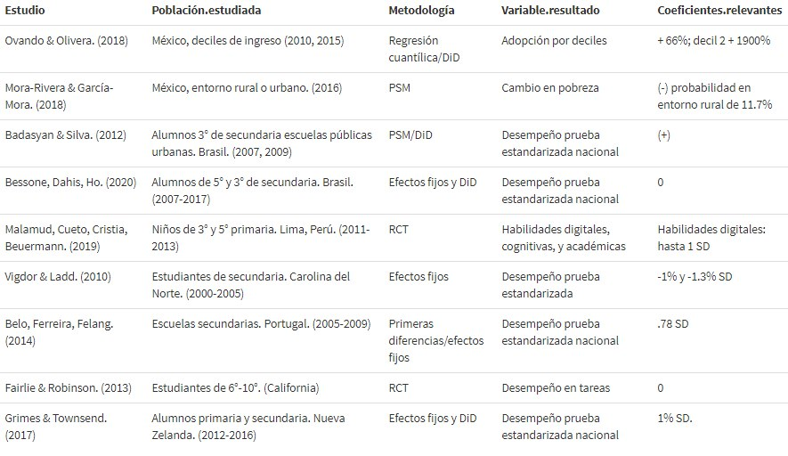

```{r global_options, include = FALSE}
knitr::opts_chunk$set(warning = FALSE, message = FALSE, echo = FALSE)
```


```{r}
#________________________
#AMBIENTE
#________________________

library(readxl)
library(readr)
library(stargazer)
library(dplyr)
library(ggplot2)
library(kableExtra)
library(stringi)
library(rdrobust)
library(rdd)
library(stats)

#________________________
#DATOS
#________________________

#CENSO 2020
#Ahora no tienen que descargar nada, todo es automatico :)
temp <- tempfile()
download.file("https://www.inegi.org.mx/contenidos/programas/ccpv/iter/zip/iter2020/iter_nalcsv20.zip",temp)
censo<-read.csv(unz(temp,"ITER_NALCSV20.csv"),encoding= "ASCII")
unlink(temp)

##CENSO 2010
censo_10<-read.csv("http://ri.uaemex.mx/bitstream/handle/20.500.11799/58449/03%20Censo%20de%20poblaci%c3%b3n%20por%20localidades%202010.csv?sequence=2&isAllowed=y")


##PLANEA 
planea_10<-read.csv("ENLACE_sec_2010.csv")
planea_15<-read_xlsx("PLANEA_2015.xlsx")
planea_19<-read_xlsx("PLANEA_2019.xlsx")
#limpieza
planea_15 <- planea_15[-c(1:2),]
planea_19 <- planea_19[-c(1:7),]

```


```{r}
#________________________
#PREPROCESAMIENTO CENSO 2010
#________________________


censo_10_localidad<-censo_10 %>% 
  select(ClaveEnt,Entidad,              #EN ESTE SELECT AGREGAMOS LAS VARIABLES QUE NECESITEMOS
         ClaveMun,Municipio,
         Localidad, ClaveLoc,
         pobtot,vivpar_hab,vph_inter,vivtot,vph_pc,phog_ind,p15ym_se,graproes,pocupada,psinder,tothog,hogjef_f,
         vph_cel,tam_loc) %>% 
  mutate(internet_10= vph_inter*100/vivpar_hab,
         pc_10 =vph_pc*100/vivpar_hab,
         pobindig_10=phog_ind*100/pobtot,
         p15sinesc_10=p15ym_se*100/pobtot,
         promesc_10=graproes*100/pobtot,
         pocup_10=pocupada*100/pobtot,
         psinsalud_10=psinder*100/pobtot,
         jefmujer_10=hogjef_f*100/vivpar_hab,
         cel_10=vph_cel*100/vivpar_hab)
         
#OJO: 84,690 MISSING VALUES PROVENIENTES DE LA BASE DE DATOS 

censo_10_localidad <- as.data.frame(t(apply(censo_10_localidad,1,toupper)))

# cambio nombres

names(censo_10_localidad)[names(censo_10_localidad) == "Entidad"] <- "NOM_ENT"
names(censo_10_localidad)[names(censo_10_localidad) == "Municipio"] <- "NOM_MUN"
names(censo_10_localidad)[names(censo_10_localidad) == "Localidad"] <- "NOM_LOC"  
  
```

```{r}
#________________________
#PREPROCESAMIENTO CENSO 2015
#________________________


```


```{r}
#________________________
#PREPROCESAMIENTO CENSO 2020
#________________________


#A) Encontrar acceso a internet (y variables que propuso sam) en censo a nivel localidad
#convierto variables de interes a numéricas
names<-c('VIVTOT','TVIVPAR','VIVPAR_HAB', #localidad
         'VPH_INTER','VPH_PC') #internet y laptop

for (i in names){
    censo[[i]] <- as.numeric(censo[[i]])
}


#creo la base de datos de interes
censo_20_localidad<-censo %>% 
  select(ENTIDAD,MUN,LOC,       #claves numéricas de localidad
    NOM_ENT,NOM_MUN,NOM_LOC,     #localidad           
         VIVTOT,TVIVPAR,VIVPAR_HAB,       # vivienda
         VPH_INTER,VPH_PC)   %>%    # internet y laptop       #EN ESTE SELECT AGREGAMOS LAS VARIABLES QUE NECESITEMOS
        mutate(internet_20=VPH_INTER*100/VIVTOT,
               pc_20=VPH_PC*100/VIVTOT)
#cambio todo a mayus
censo_20_localidad <- as.data.frame(t(apply(censo_20_localidad,1,toupper)))

# cambio nombres

names(censo_20_localidad)[names(censo_20_localidad) == "Entidad"] <- "NOM_ENT"
names(censo_20_localidad)[names(censo_20_localidad) == "Municipio"] <- "NOM_MUN"
names(censo_20_localidad)[names(censo_20_localidad) == "Localidad"] <- "NOM_LOC"  


  
```


```{r}
#________________________
#PREPOCESAMIENTO: MERGE CENSOS
#________________________

#Preparacion para 2020
censo_20_localidad$ENTIDAD<-as.numeric(censo_20_localidad$ENTIDAD)
censo_20_localidad$MUN<-as.numeric(censo_20_localidad$MUN)
censo_20_localidad$LOC<-as.numeric(censo_20_localidad$LOC)
#Creo indice INEGI
censo_20_localidad<-censo_20_localidad%>%
              mutate(MUN=sprintf("%03d",censo_20_localidad$MUN),
                     ENT=sprintf("%02d",censo_20_localidad$ENTIDAD),
                     LOC=sprintf("%04d",censo_20_localidad$LOC)) %>% 
              mutate(a=paste(ENT,MUN,sep=""))%>% 
              mutate(INEGI=paste(a,LOC,sep=""))


#Preparacion 2010 (ya viene muy preparado)
censo_10_localidad$ClaveLoc<-as.numeric(censo_10_localidad$ClaveLoc)
#Creo indice INEGI
censo_10_localidad<-censo_10_localidad%>%
                     mutate(INEGI=sprintf("%09d",censo_10$ClaveLoc))

                        
#MERGE
censos<-merge(censo_10_localidad,censo_20_localidad, by= "INEGI")

```

```{r}
#________________________
#ANALISIS CENSOS
#________________________

names<-c('pc_10','internet_10',
         'internet_20','pc_20') 

for (i in names){
    censos[[i]] <- as.numeric(censos[[i]])
}

summary(censos)

#REALITY CHECK, VIVIMOS EN UN PAIS MUY POBRE O TENEMOS UN PROBLEMA DE MISSING VALUES

```


```{r}
#________________________
#PREPROCESAMIENTO PLANTEA 2019
#________________________


#convierto variables de interes a numéricas

names<-c('...23','...24','...25','...26', #calis esp
         '...35','...36','...37','...38') #calis mate
for (i in names){
    planea_19[[i]] <- as.numeric(planea_19[[i]])
}


#cambio nombres
names(planea_19)[names(planea_19) == "P L A N E A    T E R C E R O   D E   S E C U N D A R I A   2 0 1 9"] <- "ENT"

#creo la base de datos de interes

planea_localidad_19<-planea_19 %>% 
  select(...2,...6,...7,ENT,                 
         # son entidad, municipio y loc
         ...23,...24,...25,...26,       # son % de calis de español
         ...35,...36,...37,...38)   %>% # son % de calis de mate
  group_by(...2,...6,...7,ENT) %>%
  summarize(esp_1_19 = mean(...23), 
            esp_II_19= mean(...24),
            esp_1II_19 = mean(...25), 
            esp_IV_19= mean(...26),
            mat_1_19 = mean(...35), 
            mat_II_19= mean(...36),
            mat_1II_19 = mean(...37), 
            mat_IV_19= mean(...38)) %>%
  mutate(top_50_esp_19=esp_1II_19+esp_IV_19,
         top_50_mat_19=mat_1II_19+mat_IV_19) #convierto a mi variable de interes (porcentaje de niños en la mejor mitad)

#cambio todo a mayus
planea_localidad_19 <- as.data.frame(t(apply(planea_localidad_19,1,toupper)))
  

#cambio nombres
names(planea_localidad_19)[names(planea_localidad_19) == "...2"] <- "NOM_ENT"
names(planea_localidad_19)[names(planea_localidad_19) == "...6"] <- "NOM_MUN"
names(planea_localidad_19)[names(planea_localidad_19) == "...7"] <- "NOM_LOC"

```


```{r}
#________________________
#PREPROCESAMIENTO PLANEA 2015
#________________________


#convierto variables de interes a numéricas

names<-c('...24','...25','...26','...27', #calis esp
         '...40','...41','...42','...43') #calis mate
for (i in names){
    planea_15[[i]] <- as.numeric(planea_15[[i]])
}


#creo la base de datos de interes

planea_localidad_15<-planea_15 %>% 
  select(ENT,`NOMBRE DEL MUNICIPIO`,`NOMBRE DE LA LOCALIDAD`,                  # son entidad, municipio y loc
         ...24,...25,...26,...27,       # son % de calis de español
         ...40,...41,...42,...43)   %>% # son % de calis de mate
  group_by(ENT,`NOMBRE DEL MUNICIPIO`,`NOMBRE DE LA LOCALIDAD`) %>%
  summarize(esp_1_15 = mean(...24), 
            esp_II_15= mean(...25),
            esp_1II_15 = mean(...26), 
            esp_IV_15= mean(...27),
            mat_1_15 = mean(...40), 
            mat_II_15= mean(...41),
            mat_1II_15 = mean(...42), 
            mat_IV_15= mean(...43)) %>%
  mutate(top_50_esp_15=esp_1II_15+esp_IV_15,
         top_50_mat_15=mat_1II_15+mat_IV_15) #convierto a mi variable de interes (porcentaje de niños en la mejor mitad)

#cambio todo a mayus
planea_localidad_15 <- as.data.frame(t(apply(planea_localidad_15,1,toupper)))
  

#cambio nombres

names(planea_localidad_15)[names(planea_localidad_15) == "NOMBRE DEL MUNICIPIO"] <- "NOM_MUN"
names(planea_localidad_15)[names(planea_localidad_15) == "NOMBRE DE LA LOCALIDAD"] <- "NOM_LOC"

#IMPUTACION DE NOMBRE DE ENTIDAD
claves<-planea_10 %>% select(CVE_ENT,NOM_ENT) %>% 
              group_by(NOM_ENT) %>% 
              summarise(CVE_ENT = mean(CVE_ENT))%>% 
              mutate(ENT=sprintf("%02d",CVE_ENT)) %>% 
              select(ENT,NOM_ENT)
planea_localidad_15<-merge(planea_localidad_15,claves, by="ENT")  #este merge tarda un poco, paciencia                  


```


```{r}
#________________________
#PREPROCESAMIENTO PLANTEA 2010
#________________________


planea_10<-planea_10%>%
              mutate(MUN=sprintf("%03d",planea_10$CVE_MUN),
                     ENT=sprintf("%02d",planea_10$CVE_ENT),
                     LOC=sprintf("%04d",planea_10$CVE_LOC)) %>% 
              mutate(a=paste(ENT,MUN,sep=""))%>% 
              mutate(INEGI=paste(a,LOC,sep=""))


planea_localidad_10<-planea_10 %>% 
  select(NOM_ENT,NOM_MUN,NOM_LOC,
         MUN, ENT, LOC, INEGI,                # son entidad, municipio y loc
         POR_N1_ESP_3,POR_N2_ESP_3,POR_N3_ESP_3,POR_N4_ESP_3,       # son % de calis de español
         POR_N1_MAT_3,POR_N2_MAT_3,POR_N3_MAT_3,POR_N4_MAT_3)   %>% # son % de calis de mate
  group_by(NOM_ENT,NOM_MUN,NOM_LOC,
         MUN, ENT, LOC, INEGI) %>%
  summarize(esp_1_10 = mean(POR_N1_ESP_3), 
            esp_II_10= mean(POR_N2_ESP_3),
            esp_1II_10 = mean(POR_N3_ESP_3), 
            esp_IV_10= mean(POR_N4_ESP_3),
            mat_1_10 = mean(POR_N1_MAT_3), 
            mat_II_10= mean(POR_N2_MAT_3),
            mat_1II_10 = mean(POR_N3_MAT_3), 
            mat_IV_10= mean(POR_N4_MAT_3),) %>%
  mutate(top_50_esp_10=esp_1II_10+esp_IV_10,
         top_50_mat_10=mat_1II_10+mat_IV_10) #convierto a mi variable de interes (porcentaje de niños en la mejor mitad)

#cambio todo a mayus
planea_localidad_10 <- as.data.frame(t(apply(planea_localidad_10,1,toupper)))


```


```{r}
#________________________
#correct encoding
#________________________

#esto simplemene elimina todos los caracteres especiales
# se intentaron diferentes metodos (suplantacion, recodificacion) y este es el que rescata más observaciones

planea_localidad_10$NOM_ENT<-stri_enc_toascii(planea_localidad_10$NOM_ENT)
planea_localidad_10$NOM_MUN<-stri_enc_toascii(planea_localidad_10$NOM_MUN)
planea_localidad_10$NOM_LOC<-stri_enc_toascii(planea_localidad_10$NOM_LOC)

planea_localidad_15$NOM_ENT<-stri_enc_toascii(planea_localidad_15$NOM_ENT)
planea_localidad_15$NOM_MUN<-stri_enc_toascii(planea_localidad_15$NOM_MUN)
planea_localidad_15$NOM_LOC<-stri_enc_toascii(planea_localidad_15$NOM_LOC)

planea_localidad_19$NOM_ENT<-stri_enc_toascii(planea_localidad_19$NOM_ENT)
planea_localidad_19$NOM_MUN<-stri_enc_toascii(planea_localidad_19$NOM_MUN)
planea_localidad_19$NOM_LOC<-stri_enc_toascii(planea_localidad_19$NOM_LOC)


#9481 #n del primer metodo
#10394  #n del segundo metodo
#12199  #n del tercer metodo
#12234 #lo maximo que he logrado recuperar
planeas_del_10_al_15<-as.data.frame(merge(planea_localidad_10,planea_localidad_15, by= c("ENT","NOM_MUN","NOM_LOC"))) 
#vemos un patron de municipios, son datos diferentes
#esta base solo tiene 10k obs mientras que la de abajo mantiene 14k, quiere decir que planea 15 es una base problematica 


planeas_del_10_al_19<-as.data.frame(merge(planea_localidad_10,planea_localidad_19, by= c("ENT","NOM_MUN","NOM_LOC"))) 
#summary(factor(planeas_del_10_al_19$ENT)) # tenemos 14,522 de 20k localidades que viven a traves de 2010 a 2019


```


```{r}
#________________________
#MERGE GLOBAL= FINAL DATA
#________________________

#cambio a numerico para poder hacer mutates
planeas_del_10_al_19$top_50_esp_19<-as.numeric(planeas_del_10_al_19$top_50_esp_19)
planeas_del_10_al_19$top_50_mat_19<-as.numeric(planeas_del_10_al_19$top_50_mat_19)
planeas_del_10_al_19$top_50_esp_10<-as.numeric(planeas_del_10_al_19$top_50_esp_10)
planeas_del_10_al_19$top_50_mat_10<-as.numeric(planeas_del_10_al_19$top_50_mat_10)

#ccreo el data final (por mientras)

data<-as.data.frame(merge(censos,planeas_del_10_al_19, by= c("INEGI"))) %>% 
       na.omit()  %>% mutate(cambio_internet=internet_20-internet_10,
                             cambio_pc=pc_20-pc_10,
                             cambio_esp= top_50_esp_19-top_50_esp_10,
                             cambio_mat= top_50_mat_19-top_50_mat_10)

summary(data$cambio_internet) #notamos que el cambio de internet estuvo cañon
summary(data$cambio_pc)  #notamos que el cambio de pc no tanto

```


\tableofcontents
\newpage

# Tema

En primera instancia, conocer si la Reforma en Telecomunicaciones del 2013 causó un aumento en la adopción de Internet en los hogares de México. En segunda, averiguar si hay causalidad del acceso a Internet en el hogar en el desempeño escolar (reflejado en la evaluación estandarizada nacional *Planea*) de los estudiantes mexicanos.


# Cuadro bibliografía 

Se elaboró un cuadro de resumen bibliográfico mostrando tanto efectos de la Reforma de Telecomunicaciones en México en la adopción de Internet, como del acceso a Internet a nivel celular, hogar, o escuela en variables dependientes relacionadas al desempeño educativo de estudiantes, principalmente de secundaria. Es importante recalcar que, en México, aunque se ha medido el efecto de la Reforma en Telecomunicaciones en variables relacionadas con ingreso, no se ha analizado su efecto en la educación. Mientras tanto, sí se han realizado estudios de la adopción de Internet de los hogares, pero utilizando datos censales e intercensales del 2010 y del 2015,  y con la ENIGH del 2016, no con el censo del 2020. 




# Justificación

México tiene, como algunas de sus características, un bajo nivel de calidad educativo (en las pruebas Pisa del 2018, México ocupó las posiciones 53/77, 61/78, y 57/76 en Ciencias, Habilidad Lectora, y Matemáticas, respectivamente, así como una nula mejoría en Habilidad Lectora y en Ciencias desde el 2000), y una baja penetración de cobertura de Internet: por ejemplo, se encuentra en el percentil 65 según de suscripciones a banda ancha por cada 100 habitantes del Banco Mundial del 2019, respecto al resto de los países del mundo, con 17 suscripciones por cada 100 habitantes, mientras que en los países de ingresos altos es de 34. Esta brecha digital es un reto difícil de sobrellevar debido a fallas regulatorias institucionales, una geografía compleja y densidades de población heterogéneas (Ovando & Oliveria, 2017). 

Se ha puesto poca atención en las repercusiones de una baja o pobre conectividad en el desempeño escolar, tanto en el entorno rural como urbano del país. Estudios previos  demuestran que hay disparidades muy marcadas entre alumnos con conectividad en su hogar y los que no tienen acceso a ella, o que la tienen solo a través de un teléfono móvil. Esta disparidad se conoce en la literatura como “homework gap” (Hampton & Fernandez, 2020). Es claro que existe correlación de una baja conectividad y el desempeño escolar ¿Pero qué tanto de este está causado por el acceso a Internet (o la falta de)?

El evento que causaría mayor acceso en los hogares del país, y que podría tener un efecto en el desempeño escolar, fue la Reforma en Telecomunicaciones del 2013. Esta fue llevada a cabo en un contexto en el que el mercado de telecomunicaciones en México, desde los 90s, estaba altamente concentrado, resultando en una falta de competencia, calidad de servicios baja, precios altos, y una penetración de banda ancha baja, en relación a países comparables en América Latina. ((Noll, 2012). En ella, el acceso a Internet se consagró como un derecho constitucional. Particularmente, se implementó una regulación asimétrica para "emparejar" a la participación de los otros competidores respecto a la del preponderante (Telmex en el caso de telefonía), estableciendo  las bases para garantizar una mayor competitividad en la oferta de los servicios de telecomunicaciones. Hoy en día, hay una mayor competencia y precios más bajos (Ovando & Oliveria, 2017), así como una mejora en la calidad de los servicios y una mayor cobertura de Internet. Asimismo, se implementó el Programa “México Conectado”, con el fin de llevar Internet de manera gratuita a más de 100 mil sitios y espacios públicos del país. El acceso a Internet se brinda a cada uno de los estados de la República Mexicana a través de los llamados “Puntos, México Conectado”, que se encuentran ubicados en varios sitios y espacios públicos como escuelas, bibliotecas, hospitales y centros comunitarios a nivel federal, estatal y municipal.

En suma, la Refoma, al mejorar las condiciones de competencia, permitió a México, ampliar el proceso de universalización de Internet, y escalar en el índice de accesibilidad a Internet: según el índice de accesibilidad de la OECD, en 2012, el 26% de los hogares mexicanos tenían acceso a internet y en 2019, 56.4%, es decir, un aumento mayor al doble. Sin embargo, el entorno rural se encuentra en particular desventaja: su adopción es de 39%, mientras que en el entorno urbano es de 71.2%. (Mora-Rivera & García-Mora, 2021)

Por esto, nuestro trabajo primero consistirá en determinar cuánto si existió un aumento de la adopción de Internet en los hogares debido a la Reforma, y después estimar cuánto afectó este acceso a Internet a los resultados de las evaluaciones de la prueba estandarizada nacional Planea. El alto nivel de desagregación de las bases tanto de Planea como del censo, con su base de *Principales resultados por localidad (ITER)* (2010 y 2020), nos permitirá, en primera instancia, realizar una estimación de tipo *diff-in-diff* para ver el efecto de la reforma en la adopción a Internet y después un *propensity score matching* para encontrar el efecto de tratamiento del acceso a Internet en comunidades rurales y urbanasp. Esto tendrá implicaciones relevantes en cuanto a política pública nacional. 

Por un lado, se podrá evaluar la importancia de la Reforma en el acceso a internet y con ello su impacto en el ámbito educativo, ya que, como lo refiriera el propio Senado de la República en su Boletín plublicado en 2016, el panorama existente antes de la Reforma de 2013, mostraba, por una parte, una limitada participación económica de las telecomunicaciones en el Producto Interno Bruto y, por la otra, el dominio del mercado por una sola empresa, lo que daba por resultado un espacio carente de competencia, que, entre otras cuestiones, derivaba en servicios caros y por tanto inaccesibles para gran parte de la población mexicana, sobre todo, para la más vulnerable económicamente. 

Además, a raíz de la pandemia del COVID-19, se ha puesto aún más en evidencia la necesidad del acceso a Internet y de medios tecnológicos, como computadoras, tabletas, televisiones, entre otros, como vehículos del aprendizaje y motor en la continuidad de la educación en todos los niveles. En consecuencia, hoy más que nunca resulta importante efectuar la valuación de esta política -la Reforma en telecomunicaciones de 2013, a través del programa “México Conectado”- y la medición de su impacto en la educación, con el fin de identificar áreas de oportunidad y ventanas de mejora en su implementación. 

# Aportación del trabajo (hipótesis)

El objetivo general de este trabajo es analizar el impacto que ha tenido la Reforma en Telecomunicaciones, primero a nivel general, estimando el cambio en la adopción de Internet en toda la población y después, analizando si un mayor acceso a Internet en localidades rurales y urbanas afecta positivamente en el desempeño educativo. Este mayor adopción de Internet se da  por mecanismos como la facilitación del acceso a Internet por el programa "México Conectado", u otros relacionados con el aumento de la competencia del sector que trajo consigo la Reforma, como precios más bajos o mayor cobertura. 

El presente trabajo determinará si un mayor acceso a internet en los hogares ha contribuido a elevar el desempeño educativo de los estudiantes, partiendo de la premisa de que el acceso a Internet puede mejorar la calidad de la educación en muchas maneras (por ejemplo, usando el internet para consultas o para realizar tareas), incrementando las oportunidades de aprendizaje y reduciendo la brecha digital.

El trabajo examinará el efecto de acceso a Intenet a nivel localidad en el desempeño escolar de estudiantes utilizando los datos que provee el gobierno de la evaluación Planea, la cual se aplica a alumnos de 3° de secundaria en los ámbitos de Matemáticas y Lenguaje en el año 2019. Se utilizará el método *propensity score matching* para evaluar el impacto del internet en las localidades en los resultados de las pruebas, controlando por variables como nivel de marginación, entorno rural, tipo de escuela, y por características de las viviendas de las localidades como proxy de su ingreso, donde la variable de *treatment* la obtendremos al evaluar si hubo una diferencia significativa en la adopción de internet en las localidades.

Para la primera etapa, esperaríamos que la Reforma en Telecomunicaciones, debido a los cambios que implementó ya mencionados, haya causado una mayor adopción de Internet en la población en general. Para la segunda, esperaríamos  que las localidades que tuvieron un aumento significativo en cuanto al acceso a internet hayan tenido un mayor desempeño en las calificaciones. Al controlar por características relacionadas con la desigualdad de las localidades (por ejemplo, tamaño, entorno, porcentaje de viviendas con drenaje, etc.), podremos diferenciar las disparidades en los resultados de las evaluaciones causadas por un diferenciado acceso a Internet de las disparidades causadas por diferencias iniciales. 

# Datos

Para esta tarea usaremos las bases de datos de INEGI (ITER 2010 y 2020) y la de Planea 2019. La primera para construir nuestra estimación del impacto de la reforma; la segunda para evaluar el impacto del acceso a internet y equipo de computo en las calificaicones. Aunque aún debemos evaluar la metodología más adecuada para la primera parte, podemos realizar un ejercicio preliminar con los datos actuales.

Por el momento, nuestra base de datos final consiste en un *merge* a nivel localidad de las bases de ITER 2020 del INEGI y las bases de datos de datos Planea 2019, lo que nos da un cruce entre las calificaciones de Planea y características sociodemográficas de cada localidad. Aunque vale la pena comentar que debido a que las bases usan indices distintos para el nombre de cada localidad (algunas veces con o sin acentos, con o sin mayúsculas), por lo pronto no hemos podido realizar el *merge* final, si no uno parcial donde pudimos cruzar adecuadamente la mitad de las localidades que aparecen en la base de planea. Sin embargo, actualmente estamos en ese proceso de limpieza con miras a tener la base de datos completa.


# Estadísticas descriptivas

En este apartado mostraremos estadísticas descriptivas de nuestras variables independientes y dependientes, su distribución y finalmente una regresión para cuantificar el efecto del acceso a internet y equipo de computo sobre las calificaciones.


```{r}
#________________________
#MMODELOS INGENUOS
#________________________

hist(data$cambio_internet)
hist(data$cambio_pc)


hist(data$cambio_esp)
hist(data$cambio_mat)


a<-lm(cambio_esp~cambio_internet,data)
b<-lm(cambio_esp~cambio_pc,data)
c<-lm(cambio_mat~cambio_internet,data)
d<-lm(cambio_mat~cambio_pc,data)


stargazer(a,b,c,d, type="text")

```


## Variables de interés

En la siguiente tabla podemos ver la media, desviación estandar, mínimo, máximo (entre otras) de los cuartiles de las calificaciones de Planea a nivel localidad para matemáticas y español en el 2019. Asimismo, mostramos las cifras también para dos variable que creamos (*top_50_esp* y *top_50_mat*) donde agrupamos los tercer y cuarto cuartil de cada materia, es decir la mitad con mayor calificación. Finalmente, también mostramos información para las variables *internet* y *lap* que provienen de INEGI y se refieren a el porcentaje de hogares en cada localidad con acceso a internet y a equipo de computo.

```{r, results='asis'}
#ya tenemos la base de datos preliminar y podemos poner cualquier estadistica descriptiva

f_data<-data %>% select (-VIVTOT,-TVIVPAR,-VIVPAR_HAB,-VPH_INTER,-VPH_PC)
stargazer(f_data,header=FALSE)


```


## Regresiones

Finalmente, evaluamos la relación entre el nivel de acceso a internet y a equipo de computo por localidad con la proporción de calificaciones en los últimos dos cuartiles. Lo que podemos notar es una relación positiva y estadísticamente significativa al 99% entre estas dos variables independientes y las dos variables dependientes.

```{r, results='asis'}
stargazer(a,b,c,d,header=FALSE)
```

## Modelo 


```{r, results='asis'}

attach(data)
#Comprobamos si hay discontinuidad en nuestro Score

DCdensity(cambio_internet,plot=TRUE)

```


```{r, results='asis'}

# RDPLOT

out<- rdplot(cambio_mat,cambio_internet, nbins=c(20,20),binselect = "es",y.lim=c(0,+80))
line

out<- rdplot(cambio_esp,cambio_internet, nbins=c(20,20),binselect = "es",y.lim=c(0,+80))
line
```

```{r, results='asis'}
#Plot ..
plot(cambio_internet,cambio_mat)

y.loess <- loess(cambio_mat~cambio_internet,span=.8,
                 data.frame(x=cambio_internet,y=cambio_mat))

y.predict<- predict(y.loess,data.frame(x=cambio_internet))

lines(cambio_internet,y.predict)

```


## Referencias

Belo, R., Ferreira, P., & Telang, R. (2014). Broadband in school: Impact on student performance. Management Science, 60(2), 265-282.

Bessone, P., Dahis, R., & Ho, L. (2020). The Impact of 3G Mobile Internet on Educational
Outcomes in Brazil. MIT. Disponible en: http://economics.mit.edu/files/20877

Fairlie, R. W., & Robinson, J. (2013). Experimental evidence on the effects of home computers on academic achievement among schoolchildren. American Economic Journal: Applied Economics, 5(3), 211-40.

Grimes, A., & Townsend, W. (2018). Effects of (ultra-fast) fibre broadband on student achievement. Information Economics and Policy, 44, 8-15.

Hampton, K., Fernandez, L., Robertson, C., & Bauer, J. M. (2020). Broadband and student performance gaps. Available at SSRN 3614074.

Malamud, O., Cueto, S., Cristia, J., & Beuermann, D. W. (2019). Do children benefit from internet access? Experimental evidence from Peru. Journal of Development Economics, 138, 41-56.

Mora-Rivera, J., & García-Mora, F. (2021). Internet access and poverty reduction: Evidence from rural and urban Mexico. Telecommunications Policy, 45(2), 102076.

Ovando, C., & Olivera, E. (2018). Was household internet adoption driven by the reform? Evaluation of the 2013 telecommunication reform in Mexico. Telecommunications Policy, 42(9), 700-714.

Silva, S. J., Milkman, M. I., & Badasyan, N. (2014, March). The impact of Brazil’s' Broadband at School Program'on student achievement. In 2014 TPRC Conference Paper.

Vigdor, J. L., Ladd, H. F., & Martinez, E. (2014). Scaling the digital divide: Home computer technology and student achievement. Economic Inquiry, 52(3), 1103-1119.


